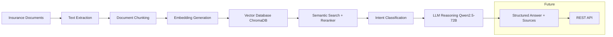

# LLM Document Processing System - Phase 1–3 Implementation (75% Progress)

## 🚀 Project Overview

This project implements the first three phases of an LLM-based document processing system.

**Currently implemented modules:**

• Document ingestion and preprocessing
• Text extraction from PDF/DOCX files (with per-page metadata)
• Document chunking (sentence, paragraph, hybrid, clause)
• Embedding generation
• Vector database storage using ChromaDB
• Semantic search with optional cross-encoder reranking
• Query intent classification
• LLM reasoning engine (Qwen2.5-72B via HuggingFace Inference API)
• Structured Q&A output with source attribution

**Modules planned for next phase:**

• REST API interface
• Docker containerization
• Cloud deployment

## 📁 Project Structure

```
llm_document_processing/
├── README.md                      # This file
├── requirements.txt               # Python dependencies
├── config.yaml                    # Main configuration
├── check_models.py                # Utility to test available HF models
├── .gitignore                    # Git ignore file
│
├── data/                         # All data files
│   ├── raw_documents/           # Place your PDF/DOCX/EML files here
│   ├── processed/               # Generated processed files
│   └── vector_db/               # ChromaDB storage
│
└── src/                         # Main source code
    ├── phase1_document_processing.py
    ├── phase2_semantic_search.py
    └── phase3_llm_engine.py
```

## 🛠 Installation & Setup

### Step 1: Environment Setup

```bash
python -m venv venv

# On Windows:
venv\Scripts\activate
# On macOS/Linux:
source venv/bin/activate

pip install -r requirements.txt
```

### Step 2: Configuration

Set your HuggingFace token in `config.yaml`:

```yaml
llm:
  hf_token: "your_token_here"
```

Or set it as an environment variable and load it in code.

### Step 3: Document Preparation

Place your documents in `data/raw_documents/`:
- Insurance policies (PDF)
- Contracts (PDF, DOCX)
- Email files (EML)
- Text files (TXT)

## 🏃 Quick Start

```bash
# Step 1: Process documents
python src/phase1_document_processing.py

# Step 2: Build semantic search index
python src/phase2_semantic_search.py [--force]

# Step 3: Run LLM Q&A engine
python src/phase3_llm_engine.py
```

## 📝 Usage Examples

### Phase 1: Document Processing

```python
from src.phase1_document_processing import DocumentProcessor

processor = DocumentProcessor()
processor.process_all_documents()
```

### Phase 2: Semantic Search

```python
from src.phase2_semantic_search import SemanticSearchEngine

search = SemanticSearchEngine()
search.build_index()
results = search.semantic_search("knee surgery waiting period")
```

### Phase 3: LLM Reasoning

```python
from src.phase3_llm_engine import LLMEngine

engine = LLMEngine()
result = engine.query("Is knee surgery covered under my policy?")
print(result["intent"])   # coverage_check
print(result["answer"])   # LLM answer with source attribution
print(result["sources"])  # list of matched chunks
```

**Interactive CLI:**
```bash
python src/phase3_llm_engine.py
```

## 🖼️ Architecture



## 🔧 Configuration

```yaml
document_processing:
  chunk_method: "clause"   # sentence | paragraph | hybrid | clause
  chunk_size: 200
  chunk_overlap: 1

embeddings:
  model_name: "BAAI/bge-large-en-v1.5"
  instruction_prefix: "Represent this document for retrieval: "
  query_instruction_prefix: "Represent this question for searching relevant passages: "

semantic_search:
  top_k: 7
  similarity_threshold: 0.0
  rerank: false
  reranker_model: "cross-encoder/ms-marco-MiniLM-L-6-v2"

llm:
  provider: "huggingface"
  model: "Qwen/Qwen2.5-72B-Instruct"
  hf_token: ""             # set your token here
  temperature: 0.0
  max_tokens: 512
  context_token_limit: 3000
```

## 🔍 Troubleshooting

1. **"Config file not found"** — ensure `config.yaml` is in the project root

2. **"No documents found"** — place files in `data/raw_documents/`

3. **"ChromaDB collection not found"** — run Phase 2 first

4. **Memory issues** — reduce `chunk_size` in config.yaml

5. **Low similarity scores**
   - Use separate `instruction_prefix` and `query_instruction_prefix`
   - Do not preprocess queries before encoding
   - After changing embedding model, delete ChromaDB and rebuild:
     ```powershell
     Remove-Item -Recurse -Force data\vector_db\chroma_db
     python src/phase2_semantic_search.py --force
     ```

6. **PyTorch not using GPU**
   ```bash
   pip uninstall torch torchvision torchaudio -y
   pip install torch torchvision torchaudio --index-url https://download.pytorch.org/whl/cu121
   python -c "import torch; print(torch.cuda.is_available())"
   ```

7. **HuggingFace API errors** — verify your token has access to the model at [huggingface.co/settings/tokens](https://huggingface.co/settings/tokens)

## 📈 Performance Tips

| Model | Params | Embedding Dim | VRAM |
|---|---|---|---|
| bge-small-en-v1.5 | 33M | 384 | < 1 GB |
| bge-base-en-v1.5 | 109M | 768 | ~1 GB |
| bge-large-en-v1.5 | 335M | 1024 | ~2 GB |

- Switch models by updating `embeddings.model_name`, then delete ChromaDB and run `--force`
- Enable `rerank: true` for better precision at the cost of speed
- Use GPU-enabled PyTorch for faster embeddings

## 🎯 Next Steps

1. **API Layer** — REST API endpoints with FastAPI
2. **Testing & Deployment** — integration tests, Docker, cloud deployment

---

**Current Status: Phase 1-3 Complete (75% Progress)**

This system provides end-to-end document processing, semantic search, and LLM-powered Q&A. The next phase will add a REST API and deployment infrastructure.
